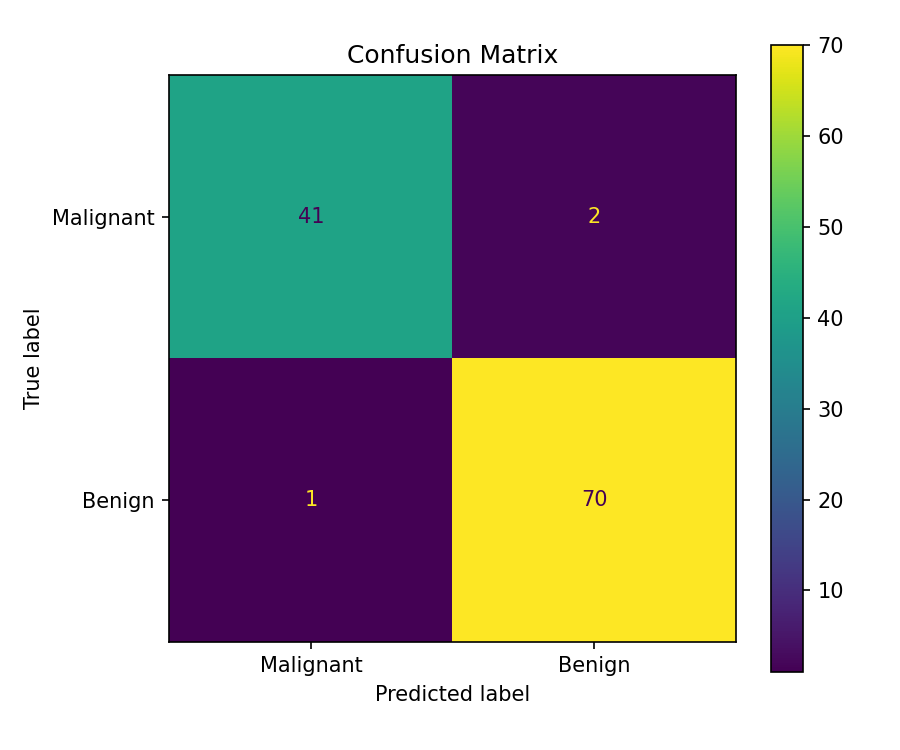
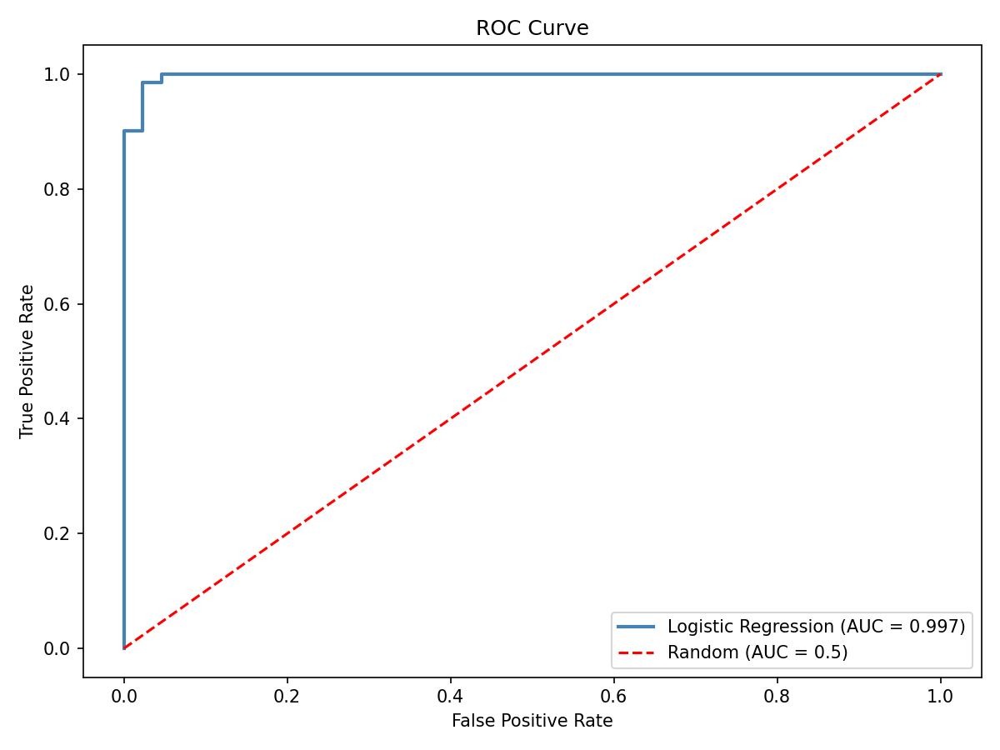
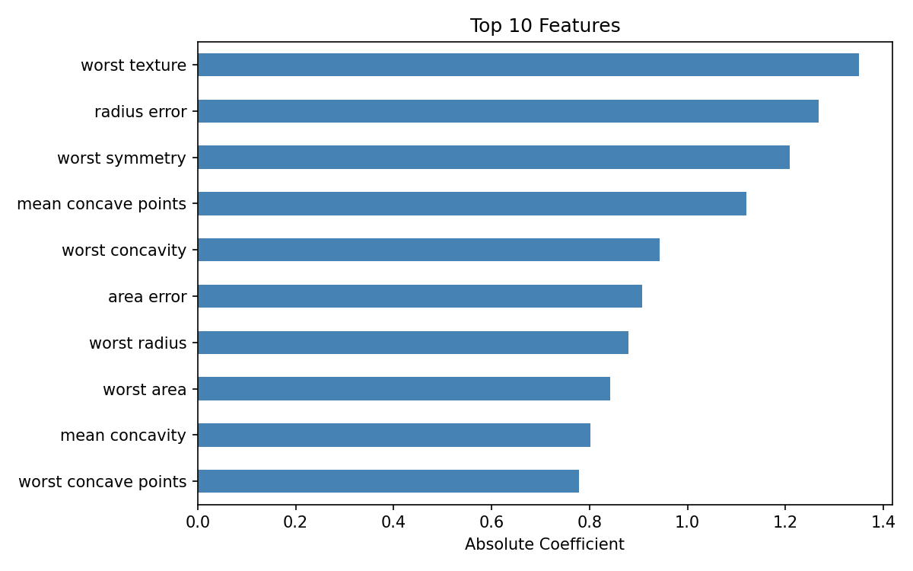
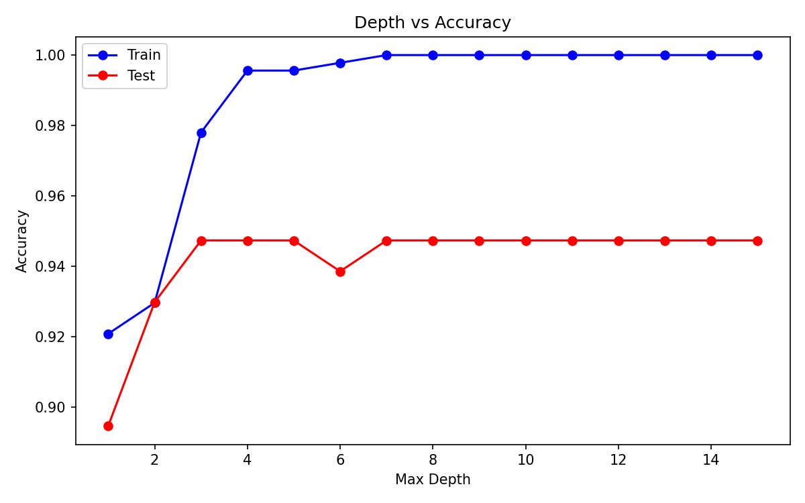
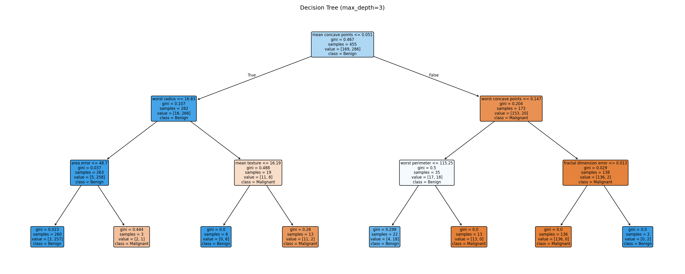
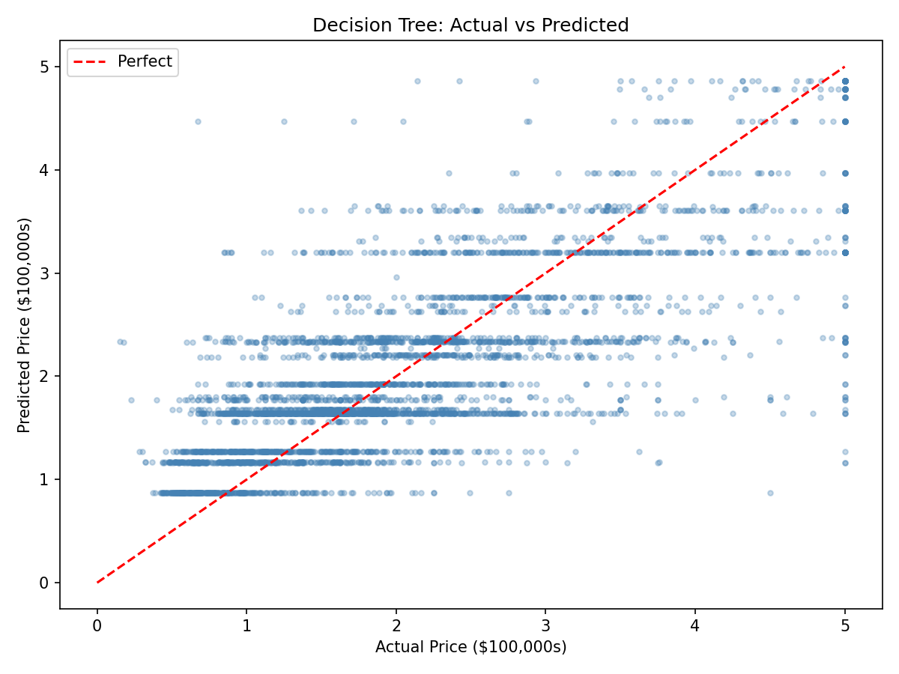

# ML Fundamentals

Working through core ML algorithms on real datasets to build a strong foundation.

## Scripts

| # | Algorithm | Dataset | Result |
|---|-----------|---------|--------|
| 01 | Linear Regression | California Housing | R² = 0.58 |
| 02 | Logistic Regression | Breast Cancer | Accuracy = 97%, AUC = 0.99 |
| 03 | Decision Tree | Breast Cancer + Calif. Housing | Acc = 95.6%, R² = 0.62 | 

## 01 - Linear Regression

Predicted California house prices using features like median income, house age and average rooms. 
The model's average prediction was off by about $74k, and median income turned out to be the most important feature by far.

R² = 0.5758 | RMSE = 0.7456 | MAE = 0.5332

## 02 - Logistic Regression

Classified breast cancer tumors as malignant or benign using 30 features. 
Added feature scaling for the first time since logistic regression needs features on the same range.
Only 3 misclassifications out of 114 test patients.

Accuracy = 97.4% | ROC AUC = 0.9974

## 03 - Decision Tree

Used decision trees on both breast cancer classification and California housing regression. 
The full tree with no limits got 100% train accuracy but dropped on test - classic overfitting.
Limiting depth to 3 fixed it. Also cool that you can actually visualize the tree and see the exact decisions it makes.

Classification Accuracy = 95.6% | Regression R² = 0.62 (better than linear regression's 0.58)

 