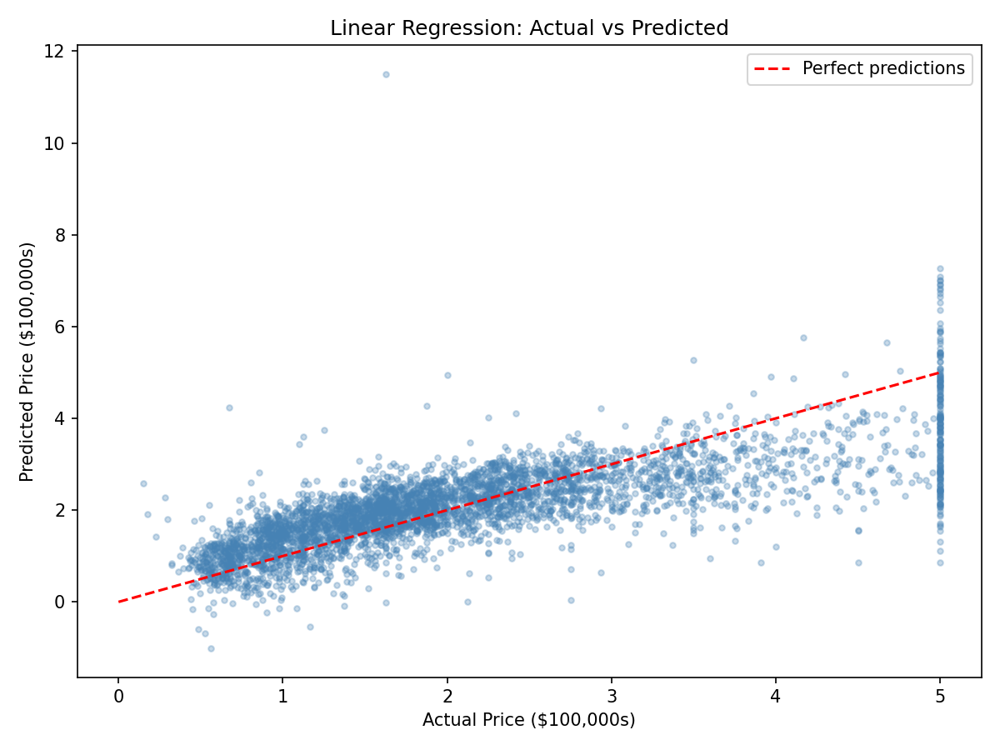
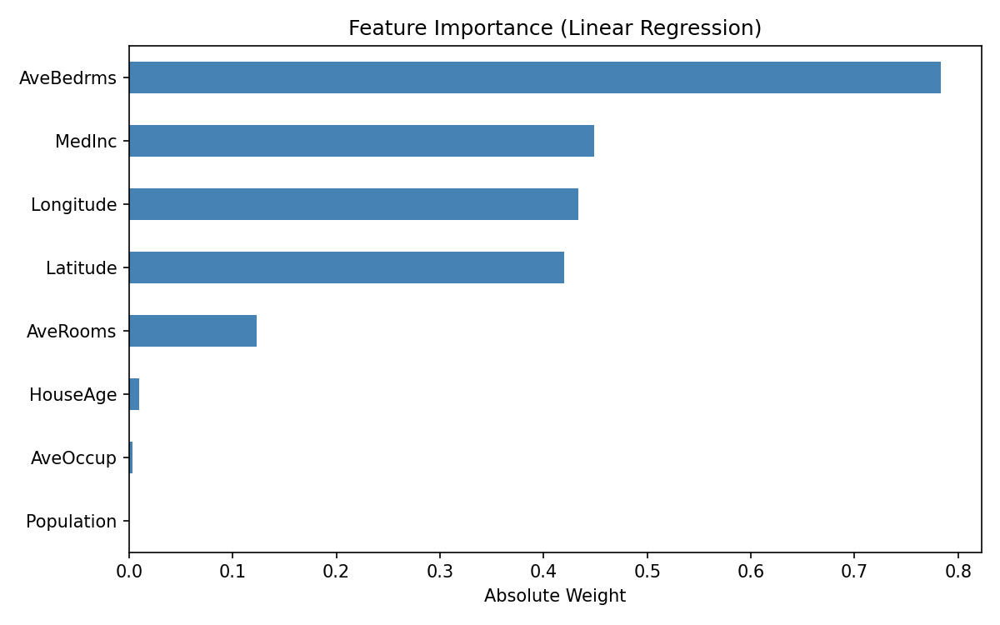

# ML Fundamentals

Working through core ML algorithms on real datasets to build a strong foundation.

## Scripts

| # | Algorithm | Dataset | Result |
|---|-----------|---------|--------|
| 01 | Linear Regression | California Housing | R² = 0.58 |

## 01 - Linear Regression

Predicted California house prices using features like median income, house age and average rooms.
The model's average prediction was off by about $74k, and median income turned out to be the most important feature by far.

R² = 0.5758 | RMSE = 0.7456 | MAE = 0.5332

